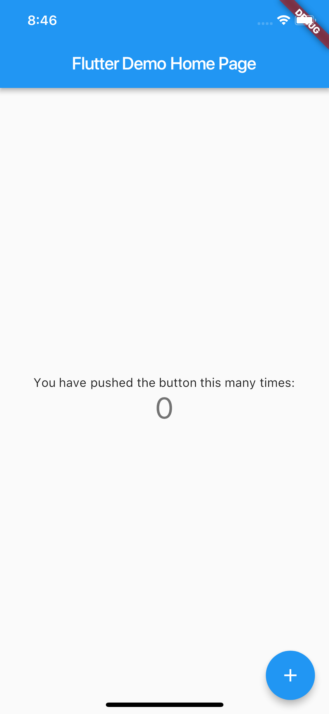
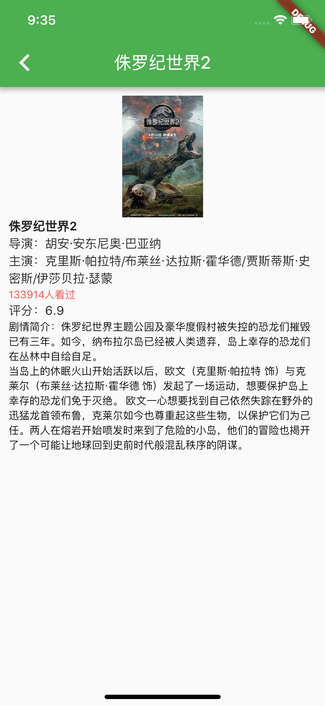

# Flutter 跨平台移动端开发框架实践报告
*欧承祖 14302010037*

## 综述
在这个实践报告里，我们简单介绍了 Google 最新的跨平台移动开发框架 Flutter，以及它的开发语言 Dart。然后，我们介绍了 Flutter 框架以及相关的移动开发环境的安装、配置。最后，我们使用 Flutter 开发了一个查看豆瓣「近期热门」电影的小应用。

## 为什么选择 Flutter
Flutter 是一个开源的跨平台移动开发框架，它来自 Google，是最近最受关注的移动开发框架，大有超越 React Native 等框架的趋势。

传统的跨平台开发框架一般采用两种模式：

- 在原生应用中包装一个 web view，然后像开发网页一样开发应用
- 封装原生平台的控件，提供某种跨平台的抽象

Flutter 使用完全不同的模式。它不仅提供了一个供开发人员用来开发应用的框架，也提供了一个可供应用运行的，可移植的运行时引擎。它使用 Skia 图形库来渲染 UI 控件，而不是仅仅封装系统控件。

这种模式给予了开发者以灵活性，使其能够更加流畅、无缝地开发跨平台应用。同时，丰富的控件也为跨平台的应用提供了统一的 UI 风格。

## Dart 语言
Flutter 应用需要使用 Dart 语言开发。Dart 语言是 Google 提出的一种面向对象的语言，不仅支持提前编译，也支持 JIT 编译。

Dart 语言提供了很多其他语言有的优良特性，比如垃圾回收，异步等待，强类型，范型等等。它还有丰富的标准库。

通过简单的阅读文档，我的最大感受是，Dart 语言就是简化版的 Java 语言。对于有 Java 开发经验的人来说，学习起来非常容易。

## 安装 Flutter
本实验是在一台 MacBook Pro (late 2017) 上的 macOS 10.13.5 High Sierra 系统上完成。因此，下面介绍在 macOS 上安装配置 Flutter 的步骤。

首先需要安装一些命令行工具：`bash`, `mkdir`, `rm`, `git`, `curl`, `unzip`, `which`，这些大多以及预装在系统中。如果没有，使用 Homebrew 安装一下即可。

接下来需要从官网下载 Flutter SDK。目前的版本是 [0.5.1-beta](https://storage.googleapis.com/flutter_infra/releases/beta/macos/flutter_macos_v0.5.1-beta.zip)。

下载下来后，解压到开发目录，并将其加入环境路径。
```bash
$ cd ~/dev
$ unzip ~/Downloads/flutter_macos_v0.5.1-beta.zip
$ export PATH=`pwd`/flutter/bin:$PATH
```

为了下次使用方便，也可以将其写入到 bash 配置文件中。

至此，已经完成了 Flutter 的安装工作。现在可以运行以下命令，查看 Flutter 开发过程中可能会需要的依赖，在你的系统上的安装情况。
```bash
$ flutter doctor
```

## 开发环境配置
下面我们来配置一下开发环境，以及相关的依赖。

Flutter 官方推荐使用 Android Studio，但是同时也支持使用其他 IDE 或者编辑器来开发。由于我们已经非常熟悉 IntelliJ IDEA 的功能特性，且 IntelliJ 也有 Dart 语言和 Flutter 框架的插件，所以我们选择使用 IntelliJ 作为主要开发工具。

开发跨平台的移动应用，需要各个平台的 SDK。由于我们在 macOS 上开发，可以通过下载安装 9.0 及以上版本的 Xcode。在 IntelliJ 中下载安装 Android SDK，就可以开发 Android 应用了。

在这个实验中，为了演示方便，我们将只在 iOS 上部署测试。在 macOS 上，可以通过启动 Simulator 来方便地调试应用。


## 开发第一个 Flutter 应用
在这个实验中，我们将从头开始使用 Flutter 开发一个，可以实时查看豆瓣上近期热映电影的，跨平台手机应用。

首先在 IntelliJ 中创建一个 Flutter 项目。因为 Dart 语言的规范要求，项目的名称必须由小写字母加下划线组成，所以我们给项目起名为 `hello_flutter`。


项目创建好之后，可以看到项目的文件目录是这样的：
```
hello_flutter
├── README.md
├── android
│   ├── app
│   │   ├── build.gradle
│   │   └── src
│   │       └── main
│   │           ├── AndroidManifest.xml
│   │           ├── java
│   │           │   ├── freemso
│   │           │   │   └── fudan
│   │           │   │       └── edu
│   │           │   │           └── helloflutter
│   │           │   │               └── MainActivity.java
│   │           │   └── io
│   │           │       └── flutter
│   │           │           └── plugins
│   │           │               └── GeneratedPluginRegistrant.java
│   │           └── res
│   │               ├── drawable
│   │               │   └── launch_background.xml
│   │               ├── mipmap-hdpi
│   │               │   └── ic_launcher.png
│   │               ├── mipmap-mdpi
│   │               │   └── ic_launcher.png
│   │               ├── mipmap-xhdpi
│   │               │   └── ic_launcher.png
│   │               ├── mipmap-xxhdpi
│   │               │   └── ic_launcher.png
│   │               ├── mipmap-xxxhdpi
│   │               │   └── ic_launcher.png
│   │               └── values
│   │                   └── styles.xml
│   ├── build.gradle
│   ├── gradle
│   │   └── wrapper
│   │       ├── gradle-wrapper.jar
│   │       └── gradle-wrapper.properties
│   ├── gradle.properties
│   ├── gradlew
│   ├── gradlew.bat
│   ├── local.properties
│   └── settings.gradle
├── hello_flutter.iml
├── hello_flutter_android.iml
├── ios
│   ├── Flutter
│   │   ├── AppFrameworkInfo.plist
│   │   ├── Debug.xcconfig
│   │   ├── Generated.xcconfig
│   │   └── Release.xcconfig
│   ├── Runner
│   │   ├── AppDelegate.swift
│   │   ├── Assets.xcassets
│   │   │   ├── AppIcon.appiconset
│   │   │   │   ├── Contents.json
│   │   │   │   ├── Icon-App-1024x1024@1x.png
│   │   │   │   ├── Icon-App-20x20@1x.png
│   │   │   │   ├── Icon-App-20x20@2x.png
│   │   │   │   ├── Icon-App-20x20@3x.png
│   │   │   │   ├── Icon-App-29x29@1x.png
│   │   │   │   ├── Icon-App-29x29@2x.png
│   │   │   │   ├── Icon-App-29x29@3x.png
│   │   │   │   ├── Icon-App-40x40@1x.png
│   │   │   │   ├── Icon-App-40x40@2x.png
│   │   │   │   ├── Icon-App-40x40@3x.png
│   │   │   │   ├── Icon-App-60x60@2x.png
│   │   │   │   ├── Icon-App-60x60@3x.png
│   │   │   │   ├── Icon-App-76x76@1x.png
│   │   │   │   ├── Icon-App-76x76@2x.png
│   │   │   │   └── Icon-App-83.5x83.5@2x.png
│   │   │   └── LaunchImage.imageset
│   │   │       ├── Contents.json
│   │   │       ├── LaunchImage.png
│   │   │       ├── LaunchImage@2x.png
│   │   │       ├── LaunchImage@3x.png
│   │   │       └── README.md
│   │   ├── Base.lproj
│   │   │   ├── LaunchScreen.storyboard
│   │   │   └── Main.storyboard
│   │   ├── GeneratedPluginRegistrant.h
│   │   ├── GeneratedPluginRegistrant.m
│   │   ├── Info.plist
│   │   └── Runner-Bridging-Header.h
│   ├── Runner.xcodeproj
│   │   ├── project.pbxproj
│   │   ├── project.xcworkspace
│   │   │   └── contents.xcworkspacedata
│   │   └── xcshareddata
│   │       └── xcschemes
│   │           └── Runner.xcscheme
│   └── Runner.xcworkspace
│       └── contents.xcworkspacedata
├── lib
│   └── main.dart
├── pubspec.lock
├── pubspec.yaml
└── test
	└── widget_test.dart

36 directories, 62 files
```

其中，我们主要的代码是写在 `hello_flutter/lib/` 目录下的，而 `lib/main.dart` 文件则存放着应用启动的入口。

目前 `main.dart` 文件中的代码是官方默认演示应用的代码。如果直接点击运行，显示的效果是这样的：

如果点击右下角的加号➕，则屏幕中间的数字会加一。

现在我们替换掉 `main.dart` 文件中的代码：
```dart
import 'package:flutter/material.dart';
import 'package:hello_flutter/movie/list/movie_list_page.dart';

// Entrance
void main() => runApp(new MyApp());

class MyApp extends StatelessWidget {
  // This widget is the root of your application.
  @override
  Widget build(BuildContext context) {
	return new MaterialApp(
	  title: 'Hello Flutter',
	  theme: new ThemeData(
		primarySwatch: Colors.green,
	  ),
	  home: new MovieListPage(),
	);
  }
}
```


其中，`main()` 函数是应用的入口，它只执行了一行，即新建了一个 `MyApp` 然后启动了它。

在 `MyApp` 类中，我们使用 `build()` 方法定义了应用的一些信息，包括主页面。这里的主页面是 `MovieListPage`，因为我们的应用将在这个页面展示一个电影条目的列表。

下面来看一下 `MovieListPage` 这个类：
```dart
class MovieListPage extends StatefulWidget {
  @override
  MovieListPageState createState() => new MovieListPageState();
}
```

Flutter 通过 stateful widgets 来保存 widget 生命周期中可变的状态。实现一个 stateful widget 需要至少两个类：一个 StatefulWidget 类和一个 State 类。StatefulWidget 负责创建一个 State，它自己是不可变的，但是它创建的那个 State 在 widget 的生命周期中是持久化的状态。

因此，有了这个 `MovieListPage`，我们还需要一个 `MovieListPageState`：
```dart
class MovieListPageState extends State<MovieListPage> {
  final httpClient = Client();
  List<Movie> movies = [];

  /// Call this method when enter this page
  @override
  void initState() {
	super.initState();
	getMovieListData();
  }
  ...
}
```

这个类有两个变量成员，一个是用来与豆瓣 API 交互的 `httpClient`，还有一个就是电影的列表。

我们通过，在页面初始化的时候一定会调用的 `initState` 函数中，调用 `getMovieListData()` 方法来获取电影的列表。这个函数是这么写的：
```dart
...
  /// Get movie list using 豆瓣 API
  getMovieListData() async {
	String response = await httpClient.read(
		'https://api.douban.com/v2/movie/in_theaters?'
			'apikey=0b2bdeda43b5688921839c8ecb20399b&city=%E5%8C%97%E4%BA%AC&'
			'start=0&count=100&client=&udid=');

	setState(() {
	  movies = Movie.allFromResponse(response);
	});
  }
...
```

它向豆瓣 API 发送了一个 HTTP 请求并使用返回结果生成了一些 movies。`Movie` 类中的 `allFromResponse` 函数会从豆瓣 API 返回的 json 中读取电影数据并创建出一个 `List<Movie>` 返回。

注意到 `getMovieListData()` 方法是 async 的，因此在调用后，程序可以继续运行其他工作，比如 UI 的渲染，而不用等待它的执行结束。

与 `MyApp` 一样，我们在 `build()` 函数中定义页面的组件：
```dart
...
  @override
  Widget build(BuildContext context) {
	var content;
	if (movies.isEmpty) {
	  content = new Center(
		child: new CircularProgressIndicator(),
	  );
	} else {
	  content = new ListView.builder(
		itemCount: movies.length,
		itemBuilder: buildMovieItem
	  );
	}

	return new Scaffold(
	  appBar: new AppBar(
		title: new Text('近期热映电影'),
		actions: <Widget>[
		  new IconButton(
			icon: new Icon(Icons.person),
			onPressed: () {
			  print('onclick');
			},
		  )
		],
	  ),
	  body: content,
	);
  }
...
```
注意到，因为在初始化时调用的 `getMovieListData()` 方法时异步的，因此在渲染 UI 的时候，可能 `movies` 还是空的。所以，我们在这里需要做一个判断：如果 `movies` 是空的，则显示一个转动的加载动画，如果 `movies` 不是空的，则创建一个 `ListView`。

上面的 `ListView` 中的每一个 item 是通过 `buildMovieItem` 来创建的：
```dart
...
  Widget buildMovieItem(BuildContext context, int index) {
	Movie movie = movies[index];

	var movieImage = new Padding(
	  padding: const EdgeInsets.only(
		top: 10.0,
		left: 10.0,
		right: 10.0,
		bottom: 10.0,
	  ),
	  child: new Image.network(
		movie.smallImage,
		width: 100.0,
		height: 120.0,),
	);

	var movieMsg = new Column(
	  crossAxisAlignment: CrossAxisAlignment.start,
	  mainAxisSize: MainAxisSize.min,
	  children: <Widget>[
		new Text(
		  movie.title,
		  textAlign: TextAlign.left,
		  style: new TextStyle(
			  fontWeight: FontWeight.bold, fontSize: 14.0
		  ),
		),
		new Text('导演：' + movie.director),
		new Text('主演：' + movie.cast),
		new Text('评分：' + movie.average.toString()),
		new Text(
		  movie.collectCount.toString() + '人看过',
		  style: new TextStyle(
			fontSize: 12.0,
			color: Colors.redAccent,),
		),
	  ],
	);

	var movieItem = new GestureDetector(
	  // Click event
	  onTap: () => navigateToMovieDetailPage(movie, index),

	  child: new Column(

		children: <Widget>[
		  new Row(

			children: <Widget>[
			  movieImage,
			  new Expanded(
				child: movieMsg,
			  ),
			  const Icon(Icons.keyboard_arrow_right),
			],
		  ),
		  new Divider(),
		],),

	);

	return movieItem;
  }
...
```

每一个 movie item 主要分成三块：一个图片块，一个文字块，和一个右箭头的图标。在每个块中分别设置好显示的样式即可，效果呈现如下：


上面的代码中有一句：
```dart
onTap: () => navigateToMovieDetailPage(movie, index),
```
这是给这个 movie item 绑定了一个点击事件，如果点击这个 item，则会调用 `navigateToMovieDetailPage` 函数。

`navigateToMovieDetailPage` 函数是用来跳转到电影详情显示页面的：
```dart
...
  /// Jump to another page
  navigateToMovieDetailPage(Movie movie, Object imageTag) {
	Navigator.of(context).push(
		new MaterialPageRoute(
			builder: (BuildContext context) {
			  return new MovieDetailPage(movie, imageTag: imageTag);
			}
		)
	);
  }
...
```

`MovieDetailPage` 的写法与 `MovieListPage` 差不多，在这里不再赘述。最后的呈现效果如下：


## 总结
使用 Flutter 开发跨平台的移动应用非常方便，框架提供的控价也非常美观大气。不过，由于目前这个框架还处于 beta 版本，标准库的改动也非常频繁，我不推荐现在就使用它开发大型移动应用。不过，这是一个非常有潜力的框架，社区也非常活跃，值得长期关注。